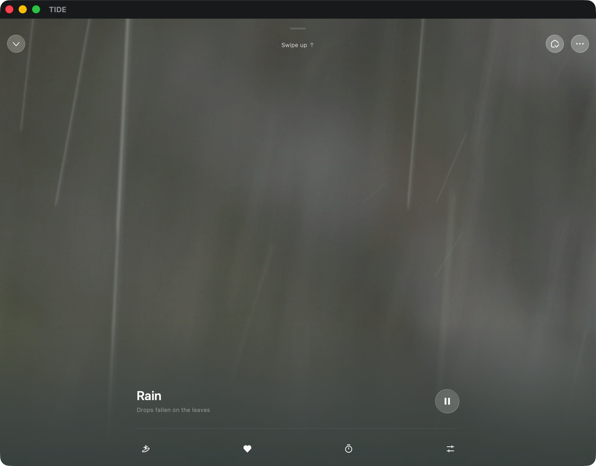

# Ripple Effect – Design Spec

## Reference

**Source**: TIDE app – "Rain: Drops fallen on the leaves"

## Visual Characteristics

### Falling Rain Streaks
- **Direction**: Nearly vertical, slight random angle variation (±3°)
- **Appearance**: Thin, semi-transparent white/light lines
- **Length**: Varies — short (30–80px) to long (100–250px)
- **Width**: Very thin, ~0.5–1.5px
- **Opacity**: Low, 0.05–0.2 (subtle, ghostly)
- **Speed**: Fast downward motion, varied per streak
- **Density**: Moderate — roughly 15–30 streaks visible at any time on desktop
- **Color**: White in dark mode; muted grey in light mode
- **Blur**: Slight motion blur / soft edges

### Background Context
- Dark, muted green-grey tones (from TIDE)
- In our blog: effect overlays existing page background, so streaks must be subtle enough to not interfere with text readability

### Combined with Existing Ripples
- Rain streaks fall from top → bottom of canvas
- Water ripples (concentric rings) appear at bottom where "drops land"
- Creates a cohesive rain scene: falling streaks + surface ripples

## Current Implementation
- **File**: `layouts/partials/ripple.html`
- **Scope**: Only rendered on `/about/` page
- **Canvas**: Positioned at bottom of document, 200px tall
- **Existing**: Concentric elliptical ripple rings simulating water surface impact

## Audio

- **File**: `static/rain.m4a` (primary), `static/rain.mp3` (fallback)
- **Source**: TIDE app rain sound – "Drops fallen on the leaves"
- **Behavior**: Looping, toggled via 🔇/🔊 button on `/about/` page
- **Template**: `layouts/about/single.html`

## Enhancement Ideas
1. Add falling rain streaks above the ripple canvas (or extend canvas upward)
2. Coordinate streak landing position with ripple spawn position
3. Keep effect performant — use `requestAnimationFrame`, lazy init via `IntersectionObserver`
