# 机器学习 -  coursera

机器学习 -  Andrew Ng(吴恩达)
[https://www.coursera.org/learn/machine-learning/home/welcome](https://www.coursera.org/learn/machine-learning/home/welcome)

# 第一周
## 总结:
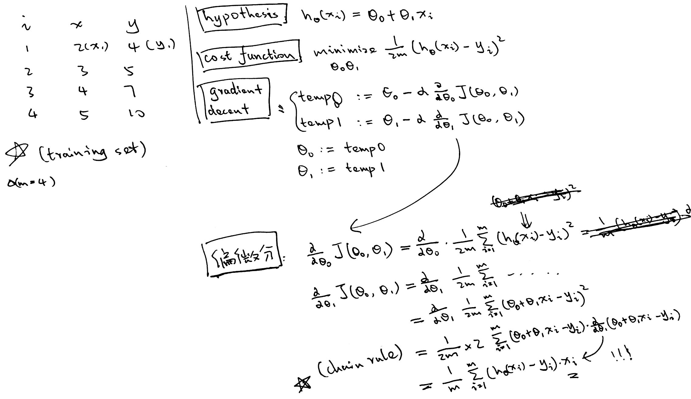

## 机器学习定义:
> Well-posed Learning Problem: A computer program is said to learnfrom experience E with respect to some task T and some performance measure P, if its performance on T, as measured by P, improves with experience E. 

`T:` Classifying emails as spam or not spam
`E:` Watching u label emails as spam or not spam
`P:` The number of emails correctly classified as spam

## 机器学习算法分类:
**Supervised Learning**
- `regression`: 在连续的数据中预测  
	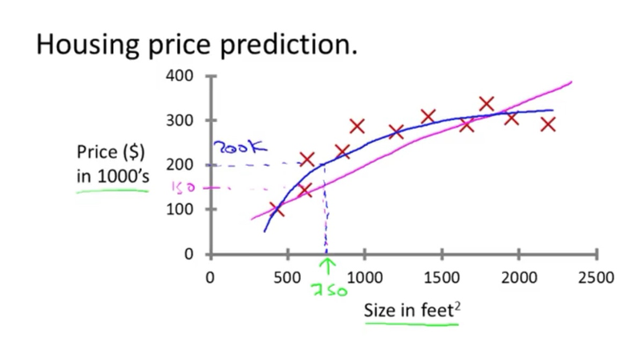
- `classification`: 最大的区别在于预测的结果, 肯定为yes or no, 或者一个集合内, e.g. 红, 黄, 蓝, 绿  
	

**Unsupervised learning**
给定数据, 在不标注的情况下, automatically identify structure
- Clustering
- Non-clustering (cocktail party problem: 麦克风的分离(two audio sources))


## Cost Function
linear regression:
- `m` = number of training  examples
- `(x_i, y_i)` → single training example, i: index

**cost function**(squared **error** function) → measure the accuracy
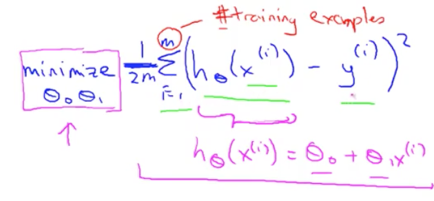
a fancier version of an average: 个人理解用平方将个别差异放大. 
(为什么要除以2m而不是m)??(哇, 下一节的笔记就有解释): The mean is halved(1/2) as a convenience for the computation of the gradient descent
(没看懂, 希望之后会提及) → 求导时会多出一个2, 刚好抵消了

linear & cost function
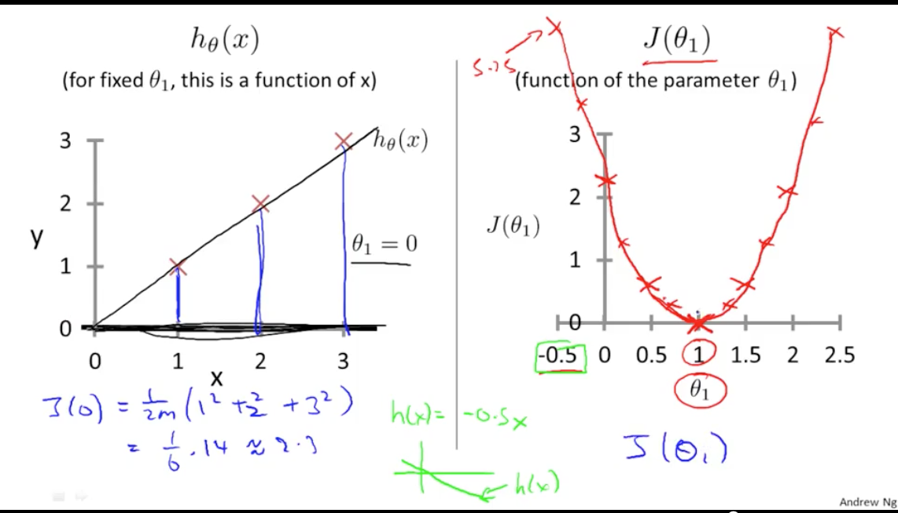
所以目标就是找到cost function的最小值: 
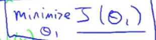

太帅了.. 
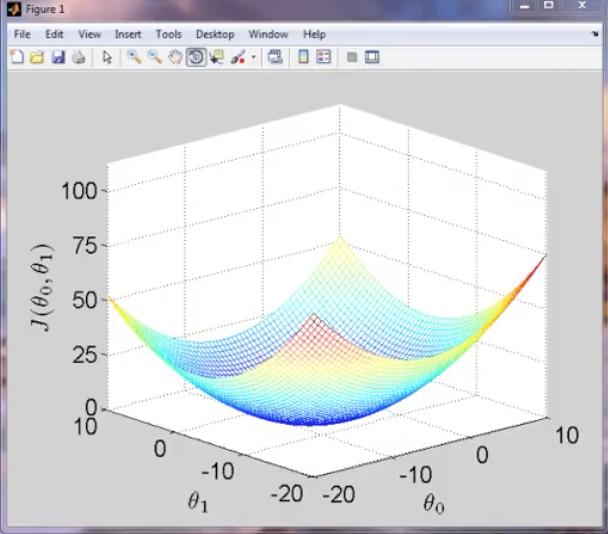


## Gradient decent
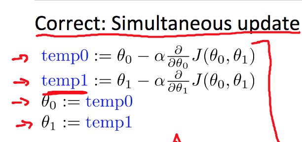
⚠️注意:
`a := b`: assignment(overwrite a’s value by b)
`a = b`: truth assignment

gradient decent + cost function 
求导(partial derivative)之后:
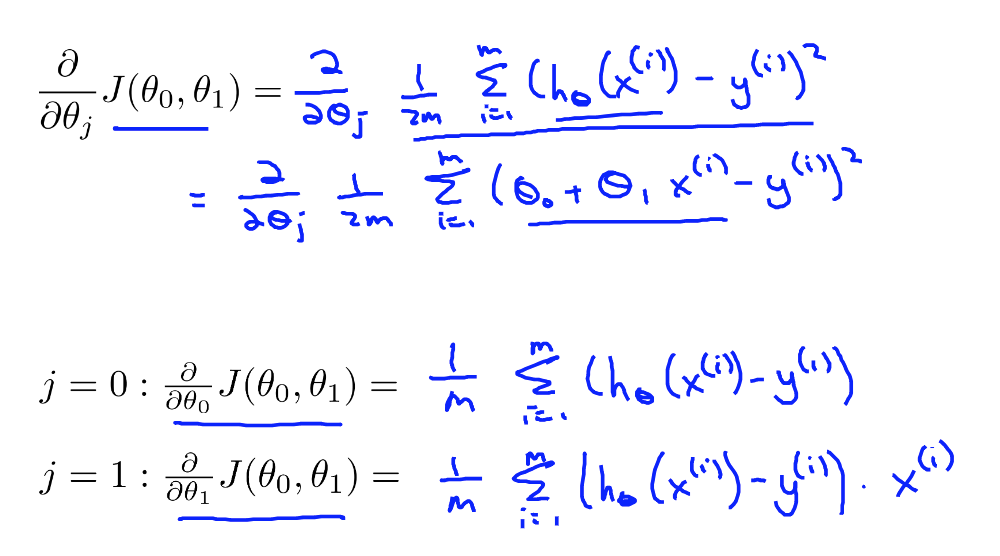
为什么θ\_1会多出x\_i?? : 求导时的参数.. 
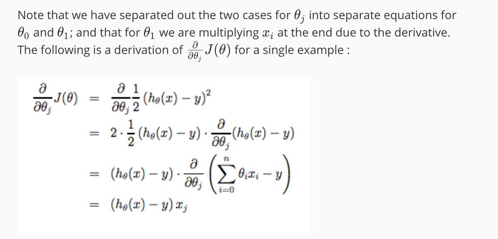
原因: 
chain rule: 
[https://zs.symbolab.com/solver/derivative-calculator/%5Cfrac%7Bd%7D%7Bdx%7D%5Cleft(%5Cleft(3x%2B1%5Cright)%5E%7B2%7D%5Cright)](https://zs.symbolab.com/solver/derivative-calculator/%5Cfrac%7Bd%7D%7Bdx%7D%5Cleft(%5Cleft(3x%2B1%5Cright)%5E%7B2%7D%5Cright))
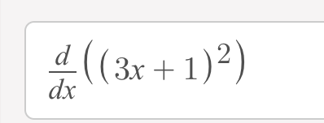


convex function(bowl shape function) → 永远只有一个最低点

batch gradient descent: 


## Linear Algebra Review()
**Matrix**
1. A: [1, 3] → 1 x 2 matrix
2. A: [1, 3] → A\_12 = 3

**Vector**
定义: n x 1 matrix
```matlab
% The ; denotes we are going back to a new row.
A = [1, 2, 3; 4, 5, 6; 7, 8, 9; 10, 11, 12]

% Initialize a vector 
v = [1;2;3] 

% Get the dimension of the matrix A where m = rows and n = columns
[m,n] = size(A)

% You could also store it this way
dim_A = size(A)

% Get the dimension of the vector v 
dim_v = size(v)

% Now let's index into the 2nd row 3rd column of matrix A
A_23 = A(2,3)
```

**一个Matrix 的加减乘除:**
```matlab
% Initialize matrix A and B 
A = [1, 2, 4; 5, 3, 2]
B = [1, 3, 4; 1, 1, 1]

% Initialize constant s 
s = 2

% See how element-wise addition works
add_AB = A + B 

% See how element-wise subtraction works
sub_AB = A - B

% See how scalar multiplication works
mult_As = A * s

% Divide A by s
div_As = A / s

% What happens if we have a Matrix + scalar?
add_As = A + s
```

**两个Matrix的相乘**
幸好以前线性代数学的还算认真, 但下边这个相乘还是挺有意思的, 而且会让你的code变得simple and efficient:
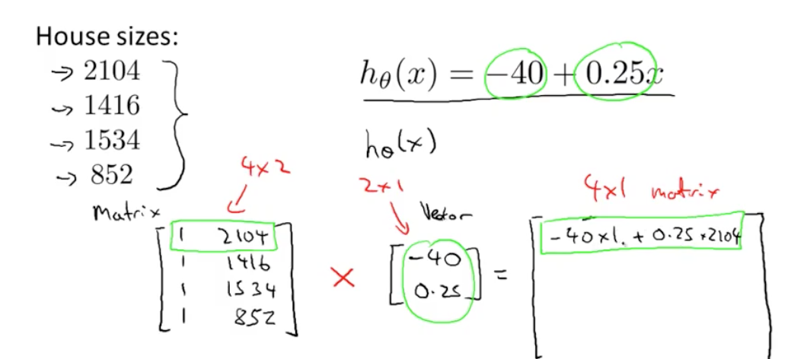
```matlab
% Initialize matrix A 
A = [1, 2, 3; 4, 5, 6;7, 8, 9] 

% Initialize vector v 
v = [1; 1; 1] 

% Multiply A * v
Av = A * v
```
同上:
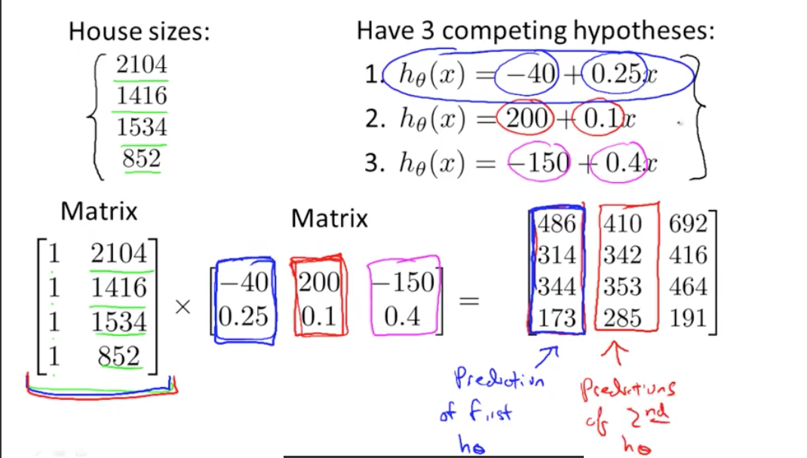

Vectorization
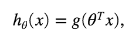


**Matrix Multiplication Properties**
1. A x B  !=  B x A (not commutative)
2. (AxB)xC = Ax(BxC) (associate)
3. identity matrix: AxI = IxA  
	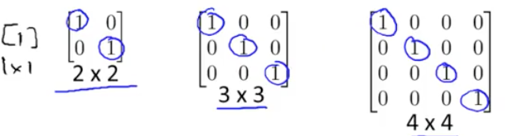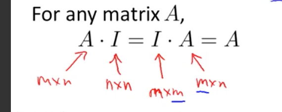
4. 

**Matrix inverse**
如何计算的呢?  很少有人手算了, 直接pinv(A)
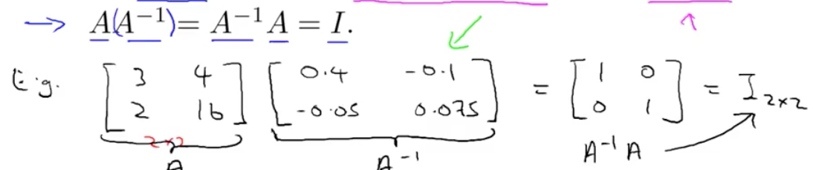
```matlab
% Transpose A 
A_trans = A' 
```


**Matrix Transpose**
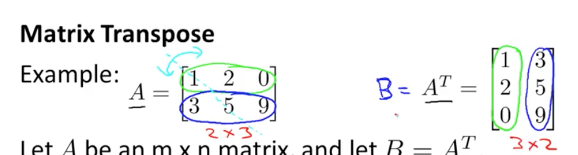
```matlab
% Take the inverse of A 
A_inv = inv(A)

% What is A^(-1)*A? 
A_invA = inv(A)*A
```


---- 

# 第二周:
MATLAB Online: [https://matlab.mathworks.com/](https://matlab.mathworks.com/)

## 总结

## Multiple Features:
1 feature: size → price
n features: size, bedrooms, floors, .. → price


**Multivariate linear regression**:
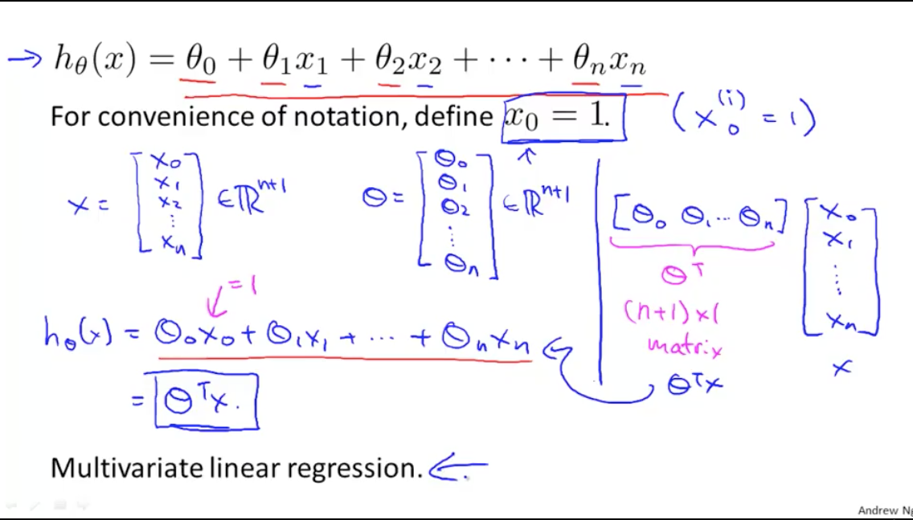
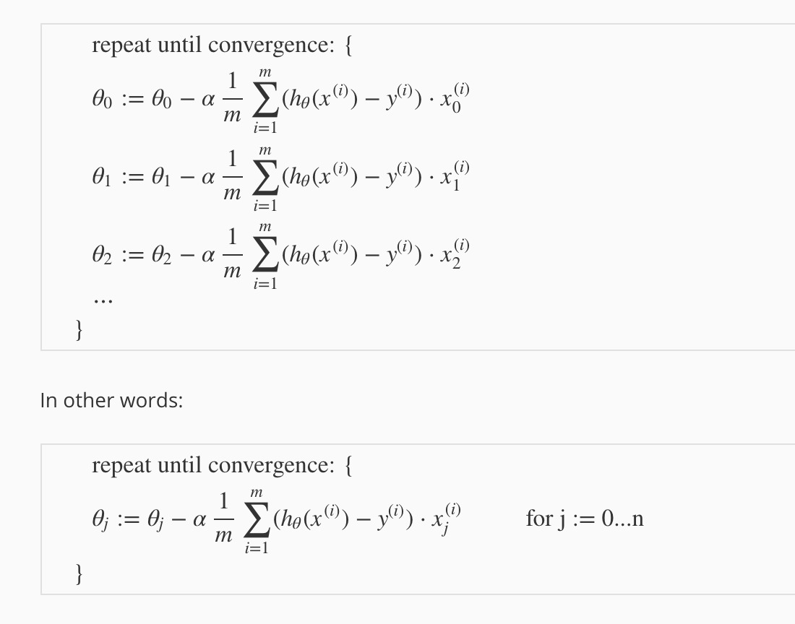

## Normalization
**Feature Scaling:**
因为不同的feature范围过大, 导致gradient decent效果太差
feature 1: -1 \<-\> 3
feature 2: -1000 \<-\>  1000

**mean normalization + feature scaling**

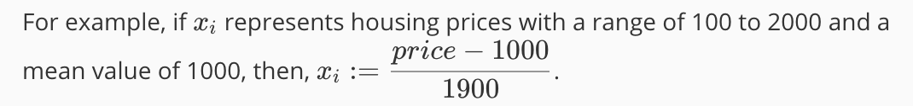


## alpha的选择: 
不能自动选择吗?


## Features and Polynomial Regression
Polynomial: 二次, 三次, n次方程, 多项式
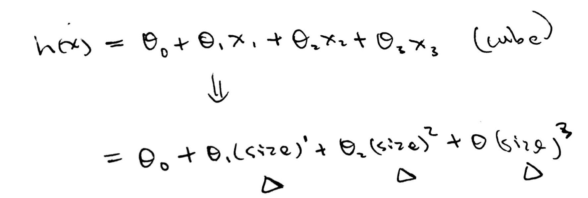
未来会传授, 如何自动选择适合的function.

## Normal Equation

具体的证明: [https://blog.csdn.net/Artprog/article/details/51172025](https://blog.csdn.net/Artprog/article/details/51172025)

# 第三周
## 问题定义
这一周主要就是为了解决聚类问题, 如下图:   


binary classification problem: `{0(negative), 1(positive)}`
multi-classification problem: `{0, 1, 2, 3}`

Linear regression对于聚类问题的局限性, 比如下图这个例子, 最右边的点就出错了:


所以新推出了Logistic Function(sigmoid function), 为了让hypothesis的值永远在0和1之间:

```matlab
function g = sigmoid(z)
%SIGMOID Compute sigmoid function
%   g = SIGMOID(z) computes the sigmoid of z.

% You need to return the following variables correctly 
% g = zeros(size(z));

% ====================== YOUR CODE HERE ======================
% Instructions: Compute the sigmoid of each value of z (z can be a matrix,
%               vector or scalar).


g = 1 ./ (1 + exp(-z));


% =============================================================

end
```

Logistic Function的值还有另外一个含义: 代表输出结果为1的可能性


Decision Boundary:

所以推导出下面👇两个等式: 
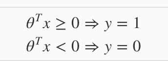

Training Set:
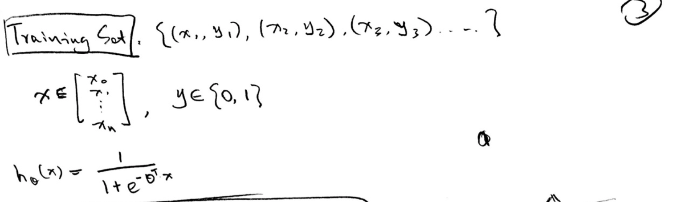

Cost function:
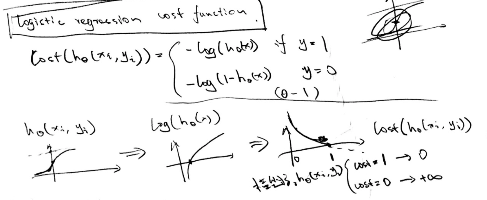


Simplified Cost Function & distance
将上面的两个cost function合并为一个:

总的distance 就等于:

求导:

```matlab
function [J, grad] = costFunction(theta, X, y)
%COSTFUNCTION Compute cost and gradient for logistic regression
%   J = COSTFUNCTION(theta, X, y) computes the cost of using theta as the
%   parameter for logistic regression and the gradient of the cost
%   w.r.t. to the parameters.

% Initialize some useful values
m = length(y); % number of training examples

% ====================== YOUR CODE HERE ======================
% Instructions: Compute the cost of a particular choice of theta.
%               You should set J to the cost.
%               Compute the partial derivatives and set grad to the partial
%               derivatives of the cost w.r.t. each parameter in theta
%
% Note: grad should have the same dimensions as theta
%

% hypothesis:
h = sigmoid(X * theta);
J = 1/m * sum(-y.*log(h) - (1-y).*log(1-h));

grad = 1/m * sum((sigmoid(X * theta) - y) .* X);

% =============================================================

end
```

如何处理multi-dimension classification的问题
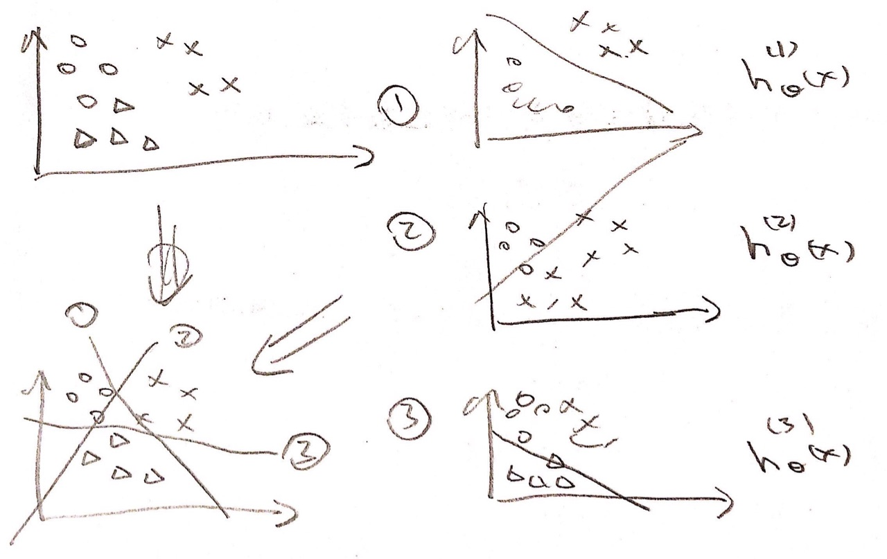


**问题:** overfilling 
**解决办法:** 
1. reduce number of features
	1. manually
	2. model selection algorithms
2. Regularization

很有趣的一段话: 
> “When I walk around Silicon Valley, I live here in Silicon Valley, there are a lot of engineers that are frankly making a ton of money for their company using machine learning algorithms. And I know we’ve only been, you know studying this stuff for a little while, But if u understand **linear regression, `logistic regression, `the advanced optimization algorithms, and regularizaion**, by now, frankly, you probably know quite a lot more machine learning than many, certainly now, but you probably know quite a lot more machine learning right now than frankly, many of the Silicon Valley engineers out there having very successful careers. You know, making tons of money for the companies. Or building products using machine learning algorithms.  ”
> 
# 第四周
## Non-linear Hypothesis:
100 features instead of two. 
50\*50 pixel images → n=2500(pixels)
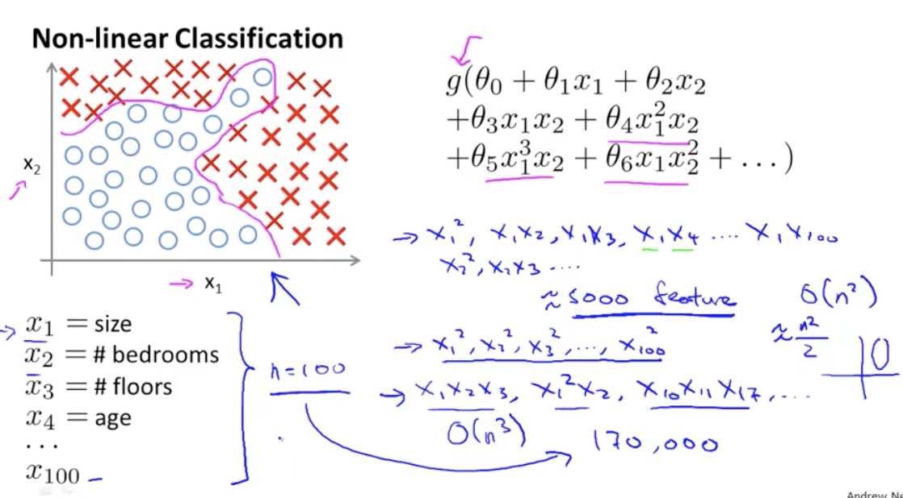

Quadratic features:  
2500: (x\_1, x\_1), (x\_1, x\_2), (x\_1, x\_2), ....
2499: (x\_2, x\_2), (x\_2, x\_3), (x\_2, x\_3), ....
...
answer = 2500 + 2499 + ... + 1 = 3 million

## Neurons and the Brain
Neural Networks → mimic the brain
但是耗费的资源太多了, 直到最近才有比较好的计算能力去执行. 

Neuron: 神经元

(brain的模拟图)
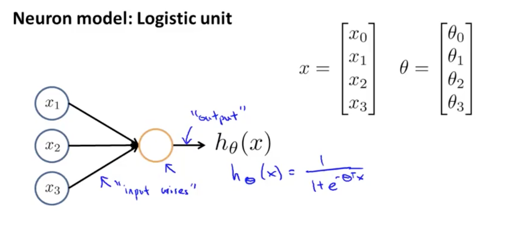

 bias unit: x\_0

计算第二层:

计算第三层: 
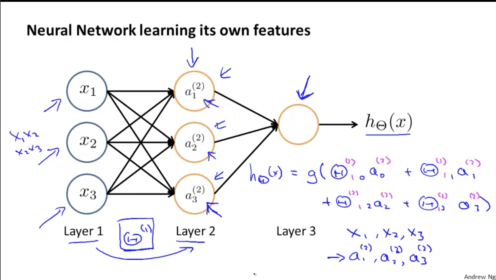


# 乱七八糟:
编程语言: Matlab or Octave
原因: 
> your coding time is the most valuable resource. 


matrix, vector or scalar: 矩阵, 向量, 数量

theta: θ
alpha: α
lambda: λ

constant e: exp(1)

slope: 斜率
converge: 收敛
derivative: 导数

